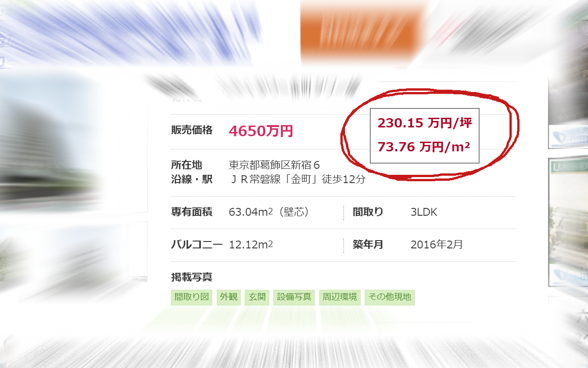

坪単価計算 Chrome 拡張
======================

金額と面積を含むテキストを選択すると、坪単価と平米単価を計算して表示します。右クリックメニューから利用できます。
この拡張機能は、不動産等のウェブサイトに表示される面積と価格から、坪単価と平米単価を簡単に計算するためのものです。

拡張機能をインストールすると、文字列を選択したときの右クリックメニューに、「坪単価を計算する」という項目が追加されます。これをクリックすると、選択した文字列から自動的に価格と面積を抽出して、坪単価と平米単価を表示します。

結果はページ上の好きなところに固定することができるので、複数の物件を比較するときに便利です。（固定前に右クリックすると削除できます）

この拡張機能は、特定の不動産サイトに縛られておらず、価格と面積さえ選択できればどのサイトでも動きます。

制限事項
--------

面積と価格を抽出するために、「円」と「坪」または「m2（m²）」の文字を同時に選択する必要があります。

インストール
============

Chrome ウェブストア からインストールできるようになる予定です。（予定URL: https://chrome.google.com/webstore/detail/eimoalfdbdiofignbcmlfgjdfdffmbcd ）

それまでは、以下の手順に沿い、自分でビルドしてインストールして下さい。

----

開発者向け情報
==============

Install
-------

	$ npm install

Development
-----------

    npm run dev chrome
    npm run dev firefox
    npm run dev opera
    npm run dev edge

Build
-----

    npm run build chrome
    npm run build firefox
    npm run build opera
    npm run build edge

Environment
-----------

The build tool also defines a variable named `process.env.NODE_ENV` in your scripts. 

Docs
----

* [webextension-toolbox](https://github.com/HaNdTriX/webextension-toolbox)
